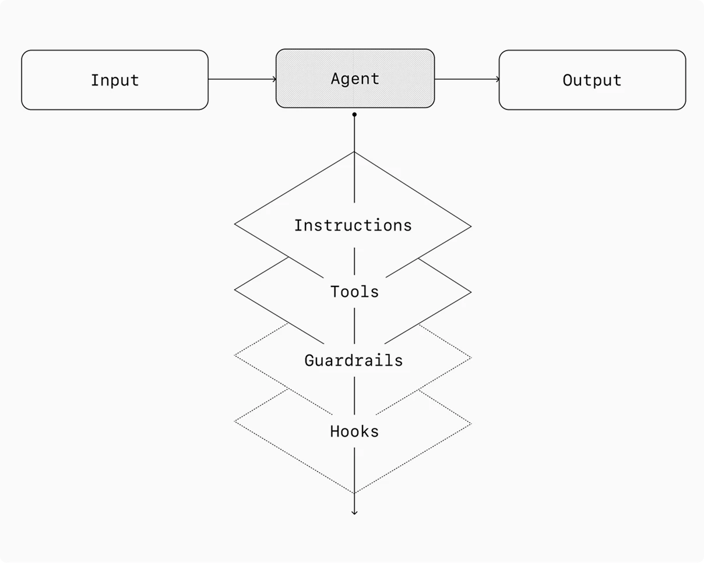

# Guardrails

## Definition

Guardrails are a layered defense mechanism that ensures agents operate safely, predictably, and within intended boundaries. No single guardrail provides sufficient protection; effective systems compose multiple specialized guardrails that run concurrently with agent execution, triggering exceptions when constraints are breached.

Guardrails address two primary risk categories:
- **Data privacy risks** — preventing system prompt leaks, PII exposure, unauthorized data access
- **Reputational risks** — enforcing brand-aligned behavior, preventing harmful outputs

## Principles

1. **Defense in depth** — Layer multiple specialized guardrails rather than relying on any single mechanism. Each addresses a different attack vector or failure mode.
2. **Optimistic execution** — The primary agent generates outputs while guardrails run concurrently. Violations trigger exceptions rather than blocking all execution upfront.
3. **Iterative expansion** — Start with data privacy and content safety guardrails, then add new ones based on real-world edge cases and failures.
4. **Balance security and UX** — Guardrails that are too aggressive degrade user experience; too permissive ones create risk. Tune as the agent evolves.

## Types of Guardrails

| Type | Mechanism | Purpose |
|------|-----------|---------|
| Relevance classifier | LLM-based | Flags off-topic queries outside intended scope |
| Safety classifier | LLM-based | Detects jailbreaks and prompt injection attempts |
| PII filter | LLM-based | Vets model output for personally identifiable information |
| Moderation | API-based | Flags harmful/inappropriate inputs (hate speech, harassment, violence) |
| Tool safeguards | Risk-rated | Assigns low/medium/high risk to tools based on reversibility, permissions, financial impact |
| Rules-based protections | Deterministic | Blocklists, input length limits, regex filters for known threats |
| Output validation | Prompt + checks | Ensures responses align with brand values via content checks |

## Tool Risk Assessment

Each tool available to an agent should be rated by risk level based on:
- Read-only vs. write access
- Reversibility of actions
- Required account permissions
- Financial impact

These ratings trigger automated actions: pausing for guardrail checks before high-risk functions, or escalating to [[human-intervention|human intervention]] when needed.

## Implementation Approach

The recommended heuristic for building guardrails incrementally:

1. Focus first on data privacy and content safety
2. Add guardrails based on real-world edge cases and failures encountered in production
3. Optimize for both security and user experience as the agent evolves

Guardrails should complement — not replace — robust authentication, authorization protocols, strict access controls, and standard software security measures.

## Relationships

Guardrails are one of the four internal components of an agent (alongside instructions, tools, and hooks). They work alongside [[human-intervention|Human Intervention]] as complementary safety mechanisms — guardrails handle automated detection while human intervention handles escalation. The [[agent-design-principles|Agent Design Principles]] synthesis page covers guardrails as part of the broader principle of managing autonomous agent risks.

## See also

- [[human-intervention|Human Intervention]]
- [[agent-design-principles|Agent Design Principles]]
- [[agentic-systems|Agentic Systems]]
- [[tool-taxonomy|Tool Taxonomy]]
- [[augmented-llm|The Augmented LLM]]
