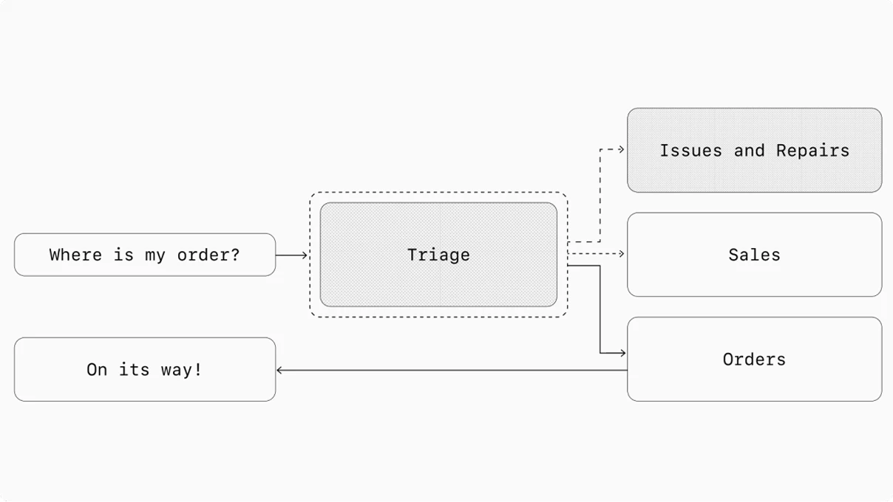

# Decentralized Pattern

## What it is

The decentralized pattern is a multi-agent orchestration approach where peer agents hand off workflow execution to one another. Unlike the [[manager-pattern|Manager Pattern]], there is no central coordinator — each agent operates on equal footing and can directly transfer control to another agent when the task falls outside its specialization.

A handoff is a one-way transfer: the originating agent delegates execution entirely to the target agent, along with the full conversation state. The target agent then interacts with the user directly. Optionally, the target can hand off back to the original agent if needed.

In graph terms, with agents as nodes, edges in the decentralized pattern represent handoffs that transfer execution between agents (as opposed to tool calls in the manager pattern).



## When to use

Use the decentralized pattern when:
- You don't need a single agent maintaining central control or synthesis
- Each specialized agent should fully take over and interact with the user directly
- The workflow naturally routes between distinct domains (e.g., support departments)
- You want conversation triage with clean handoffs
- The task is better served by the specialized agent having full conversational authority

## How to implement

1. **Define specialized agents** — each with focused instructions and domain-specific tools.
2. **Define a triage agent** — the initial entry point that assesses the user's query and routes to the appropriate specialist.
3. **Configure handoffs** — register which agents can hand off to which other agents.
4. **Transfer conversation state** — when a handoff occurs, the full conversation history transfers to the new agent.
5. **Optionally enable return handoffs** — allow the receiving agent to hand back if the task changes scope.

```python
triage_agent = Agent(
    name="Triage Agent",
    instructions=(
        "You act as the first point of contact, assessing customer queries "
        "and directing them to the correct specialized agent."
    ),
    handoffs=[
        technical_support_agent,
        sales_assistant_agent,
        order_management_agent,
    ],
)
```

## Example

- **Customer service triage** — Triage agent identifies whether the query is about technical support, sales, or orders, then hands off to the specialist who handles the full interaction
- **Multi-department routing** — HR, IT, Facilities each have their own agent; an intake agent routes employees to the right department
- **Escalation chains** — Agent A handles straightforward cases, hands off to Agent B for complex cases requiring deeper expertise

## Pitfalls

- Context can fragment if conversation state isn't fully transferred during handoffs
- Circular handoffs: Agent A hands to B, B hands back to A indefinitely — implement loop detection
- User confusion if the conversational style shifts noticeably between agents
- Harder to maintain a unified view of the overall interaction for analytics or compliance
- Debugging is complex: the execution path through multiple agents is only apparent at runtime

## Manager vs. Decentralized: When to Choose

| Factor | Manager | Decentralized |
|--------|---------|---------------|
| Central control needed | Yes | No |
| Synthesis of multiple outputs | Manager synthesizes | Each agent responds independently |
| User interaction | Only manager talks to user | Any agent can talk to user |
| Complexity of routing | Manager decides via tools | Handoffs between peers |
| Best for | Multi-capability responses | Triage / domain routing |

## See also

- [[manager-pattern|Manager Pattern]]
- [[orchestrator-workers|Orchestrator-Workers]]
- [[routing|Routing]]
- [[agentic-systems|Agentic Systems]]
- [[agent-design-principles|Agent Design Principles]]
