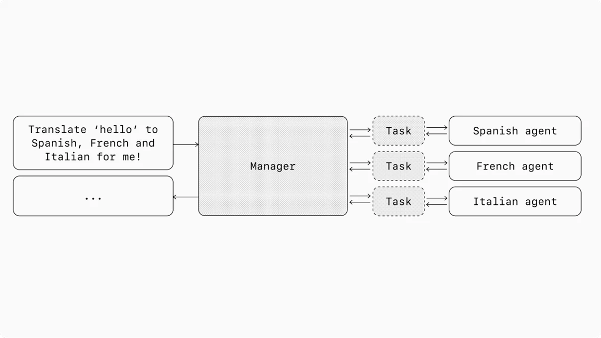

# Manager Pattern

## What it is

The manager pattern is a multi-agent orchestration approach where a central LLM — the "manager" — coordinates multiple specialized agents through tool calls. The manager intelligently delegates tasks to the right agent at the right time, then synthesizes results into a cohesive interaction. Crucially, the manager maintains control throughout: it never loses context and always mediates between the user and specialized agents.

In graph terms, multi-agent systems are modeled with agents as nodes. In the manager pattern, edges represent tool calls from the manager to specialized agents.



## When to use

Use the manager pattern when:
- You need one agent to maintain central control of workflow execution
- Only the manager should have direct access to the user
- You want to synthesize outputs from multiple specialists into a unified response
- Tasks can be clearly decomposed and routed to domain-specific agents
- You need a coherent conversational experience despite leveraging multiple specialized capabilities

## How to implement

1. **Define the manager agent** with instructions that describe its coordination role and the available specialized agents.
2. **Register specialized agents as tools** — each sub-agent is exposed to the manager as a callable function with a descriptive name and purpose.
3. **Design tool descriptions carefully** — the manager selects sub-agents based on tool descriptions, so clarity is critical.
4. **Implement the run loop** — the manager operates in a loop, calling sub-agents as needed until an exit condition is met (final output or direct user response).
5. **Handle synthesis** — the manager combines sub-agent responses into a coherent final output.

```python
manager_agent = Agent(
    name="manager_agent",
    instructions="You are a translation agent. You use tools to translate.",
    tools=[
        spanish_agent.as_tool(
            tool_name="translate_to_spanish",
            tool_description="Translate the user's message to Spanish",
        ),
        french_agent.as_tool(
            tool_name="translate_to_french",
            tool_description="Translate the user's message to French",
        ),
    ],
)
```

## Example

- **Translation services** — Manager receives a multi-language request, delegates to language-specific agents, combines all translations in one response
- **Research synthesis** — Manager breaks a research question into sub-queries, delegates to domain-specific research agents, synthesizes findings
- **Customer support routing** — Manager identifies issue type and delegates to specialized agents while maintaining the conversation

## Pitfalls

- Manager's comprehension of sub-agent capabilities is limited by tool descriptions — invest in clear, precise descriptions
- Adds latency: manager call + sub-agent call(s) + synthesis
- Debugging is harder when issues span the manager-to-sub-agent boundary
- The manager can become a bottleneck if too many sub-agents compete for its attention
- Over-decomposition: don't create separate agents for tasks a single agent with tools could handle

## Relationship to Orchestrator-Workers

The manager pattern and [[orchestrator-workers|Orchestrator-Workers]] are closely related. The key distinction: orchestrator-workers (from Anthropic's taxonomy) emphasizes dynamic task decomposition where the orchestrator decides *what* subtasks to create at runtime. The manager pattern emphasizes *pre-defined specialized agents* that the manager selects among. In practice, these patterns blend — a manager may dynamically decide which agents to invoke for a given input.

## See also

- [[decentralized-pattern|Decentralized Pattern]]
- [[orchestrator-workers|Orchestrator-Workers]]
- [[tool-taxonomy|Tool Taxonomy]]
- [[agentic-systems|Agentic Systems]]
- [[agent-design-principles|Agent Design Principles]]
