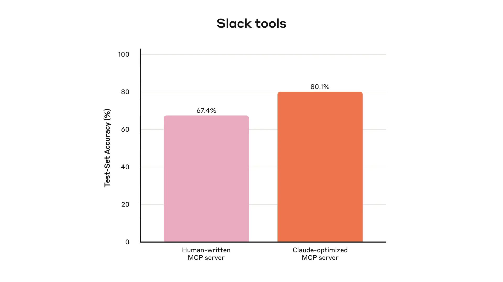
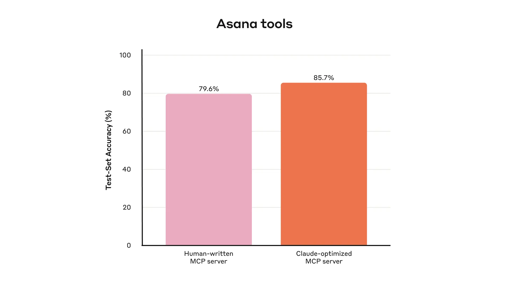
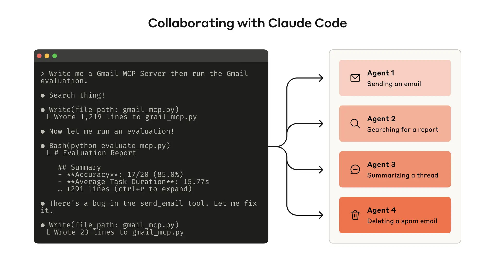

# Tool Evaluation

## What

Tool evaluation is an iterative, evaluation-driven methodology for measuring and improving how well agents use tools. Rather than relying on intuition, it establishes a systematic feedback loop: prototype → evaluate → analyze → improve → re-evaluate. The key insight is that agents themselves can participate in the improvement cycle — analyzing evaluation transcripts and refactoring tools to be more effective.

## When to use

- When building or refining MCP servers or tool sets for LLM agents
- When agent performance on tool-use tasks is below expectations
- When scaling from a prototype to production-quality tooling
- When multiple tools overlap in function and need rationalization

## How

### Step 1: Build a prototype

Stand up a quick working version of your tools. Wrap them in a local MCP server for testing in Claude Code or the Claude Desktop app. Give the agent documentation (especially `llms.txt` files) for any libraries or APIs your tools rely on.

Test the tools yourself to identify rough edges and collect user feedback on expected use cases.

### Step 2: Generate evaluation tasks

Create prompt-response pairs grounded in real-world complexity:

**Strong tasks** require multiple tool calls and mirror realistic workflows:
- "Schedule a meeting with Jane next week to discuss our Acme Corp project. Attach the notes from our last planning meeting and reserve a conference room."
- "Customer ID 9182 reported triple-charging. Find all relevant log entries and determine if other customers were affected."

**Weak tasks** are overly specific and don't stress-test tool ergonomics:
- "Schedule a meeting with jane@acme.corp next week."
- "Search the payment logs for `purchase_complete` and `customer_id=9182`."

Pair each prompt with a verifiable outcome. Verifiers range from exact string matching to LLM-as-judge approaches. Avoid overly strict verifiers that reject valid alternative phrasings.

### Step 3: Run the evaluation programmatically

Use simple agentic loops (`while`-loops wrapping alternating API and tool calls), one loop per task. Each evaluation agent gets a single task and the tool set.

Instruct evaluation agents to output reasoning and feedback blocks *before* tool calls and response blocks — this triggers chain-of-thought behaviors that increase effective intelligence. Alternatively, use interleaved thinking for similar benefits.

Collect metrics beyond accuracy:
- Runtime per tool call and per task
- Total tool calls per task
- Token consumption
- Tool error rates

### Step 4: Analyze results

Read through evaluation agents' reasoning, feedback, and raw transcripts. What agents *omit* is often more revealing than what they include. Key signals:

- Redundant tool calls → tools need better pagination or consolidation
- Invalid parameter errors → descriptions need clarity or examples
- Agents appending unnecessary context → tool descriptions should steer behavior

### Step 5: Collaborate with agents to improve

Concatenate evaluation transcripts and pass them to Claude Code. Agents excel at analyzing transcripts and refactoring multiple tools simultaneously to maintain self-consistency.

Use held-out test sets to guard against overfitting. Anthropic's internal evaluations show Claude-optimized tools outperform both human-written tools and Claude's own first-pass implementations on held-out data.

## Example

A Gmail MCP server development cycle:
1. Claude Code writes `gmail_mcp.py` (1,219 lines) from documentation
2. Evaluation runs: 17/20 accuracy (85.0%), avg duration 15.77s
3. Analysis reveals a bug in `send_email` tool
4. Claude fixes the tool (23 lines changed)
5. Re-evaluation shows improved accuracy

## Pitfalls

- **Sandbox environments** — Avoid overly simplistic test environments that don't mirror real-world complexity. Tasks should require dozens of tool calls, not just one.
- **Overfitting to training evals** — Always maintain a held-out test set separate from the evaluation set used for improvement.
- **Overspecifying strategies** — Multiple valid paths may exist for a task. Avoid grading on exact tool-call sequences.
- **Ignoring CoT signals** — The reasoning traces reveal *why* agents struggle, not just *that* they failed.

## See also

- [[agent-computer-interface|Agent-Computer Interface (ACI)]]
- [[tool-response-design|Tool Response Design]]
- [[tool-selection|Tool Selection]]
- [[tool-namespacing|Tool Namespacing]]
- [[evaluator-optimizer|Evaluator-Optimizer]]
- [[tool-taxonomy|Tool Taxonomy]]
