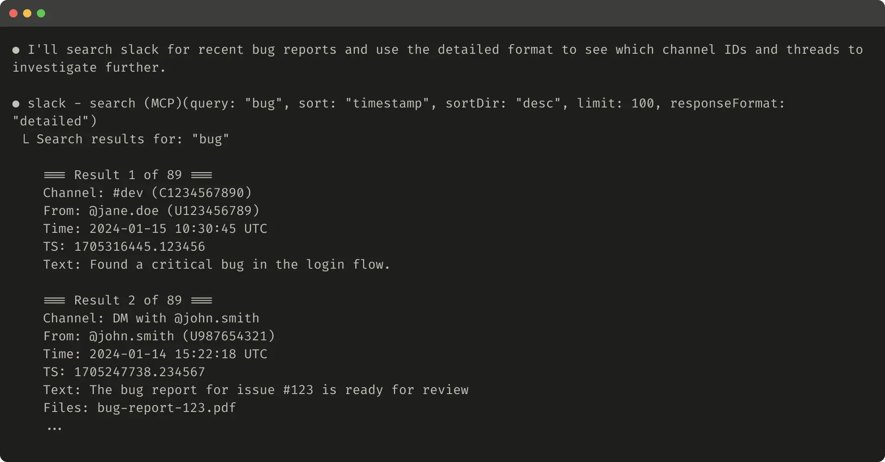
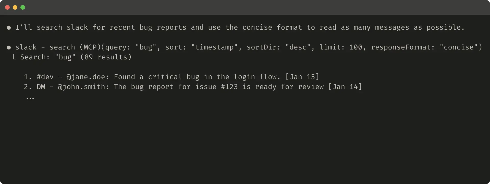
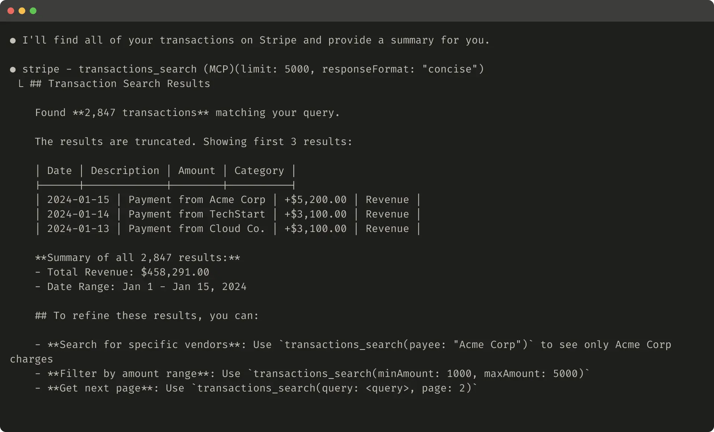
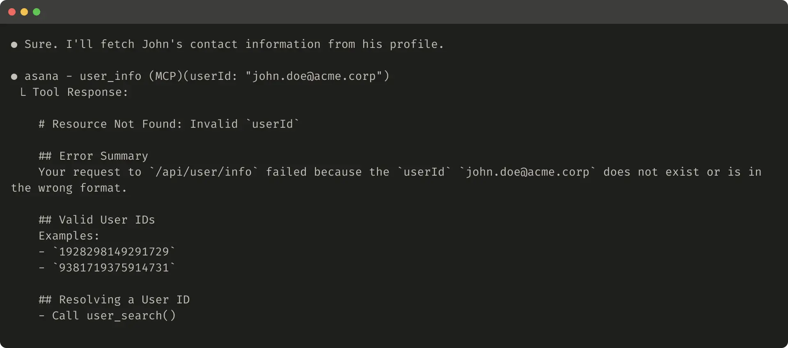

# Tool Response Design

## What

Tool response design is the practice of engineering what tools return to agents for maximum effectiveness — controlling both the quality and quantity of context that flows back through tool responses. It encompasses response format flexibility, token efficiency strategies, and error message design.

The core principle: tool responses should prioritize contextual relevance over flexibility, returning only high-signal information that directly informs agents' downstream actions.

## When to use

- When tools return large payloads that consume excessive context
- When agents make redundant tool calls to gather information
- When agents struggle with cryptic identifiers in tool responses
- When tool errors lead to agent confusion or repeated failures
- When optimizing token costs in agentic workflows

## How

### Meaningful context over raw data

Tool responses should emphasize semantically meaningful fields over low-level technical identifiers:

| Prefer | Avoid |
|--------|-------|
| `name` | `uuid` |
| `image_url` | `256px_image_url` |
| `file_type` | `mime_type` |
| Human-readable names | Alphanumeric IDs |

Resolving arbitrary UUIDs to natural language identifiers significantly reduces hallucinations in retrieval tasks. When agents must interact with both human-readable and technical identifiers (e.g., `search_user(name='jane')` → `send_message(id=12345)`), use a response format parameter.

### Response format enum

Expose a `response_format` parameter to let agents control verbosity:

```
enum ResponseFormat {
   DETAILED = "detailed",
   CONCISE = "concise"
}
```

- **Detailed** — Includes all fields (IDs, timestamps, metadata) needed for downstream tool calls. Use when the agent needs to chain actions.
- **Concise** — Returns only content and natural-language identifiers. Use when the agent needs to read/summarize. Uses ~⅓ of the tokens.





This can be extended further toward a GraphQL-style approach where agents select exactly which fields they want.

### Token efficiency strategies

For any tool response that could consume large amounts of context:

1. **Pagination** — Return results in pages with clear "next page" instructions
2. **Range selection** — Allow agents to specify date/count ranges
3. **Filtering** — Let agents narrow results via parameters
4. **Truncation** — Cap responses with helpful instructions on how to refine

Claude Code restricts tool responses to 25,000 tokens by default. Steer agents toward multiple targeted searches rather than single broad searches.



### Helpful error responses

When tool calls fail, error responses should be specific, actionable, and educational:

**Helpful error** — Explains what went wrong, shows valid formats, and suggests how to resolve:
```
# Resource Not Found: Invalid `userId`
Your request failed because `john.doe@acme.corp` is not a valid userId.
## Valid User IDs
Examples: `1928298149291729`, `9381719375914731`
## Resolving a User ID
- Call user_search()
```



**Unhelpful error** — Opaque error codes or raw tracebacks that don't guide the agent toward a fix.

### Response structure format

The choice of response structure (XML, JSON, Markdown) has non-trivial effects on performance. LLMs perform better with formats matching their training data. There is no universal best format — select based on your own evaluation results for the specific task and agent.

## Pitfalls

- **Returning everything by default** — Agents waste context processing irrelevant fields. Default to concise; let agents request detail when needed.
- **Opaque error messages** — Error codes without guidance cause agents to retry blindly or hallucinate workarounds.
- **Ignoring token budgets** — Unbounded responses can exhaust an agent's effective context window.
- **Using UUIDs as primary identifiers** — Agents hallucinate arbitrary alphanumeric strings. Use human-readable names wherever possible.

## See also

- [[agent-computer-interface|Agent-Computer Interface (ACI)]]
- [[tool-evaluation|Tool Evaluation]]
- [[tool-selection|Tool Selection]]
- [[tool-namespacing|Tool Namespacing]]
- [[tool-taxonomy|Tool Taxonomy]]
- [[augmented-llm|The Augmented LLM]]
